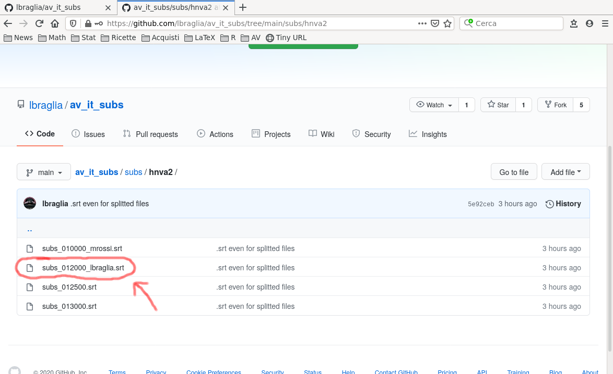
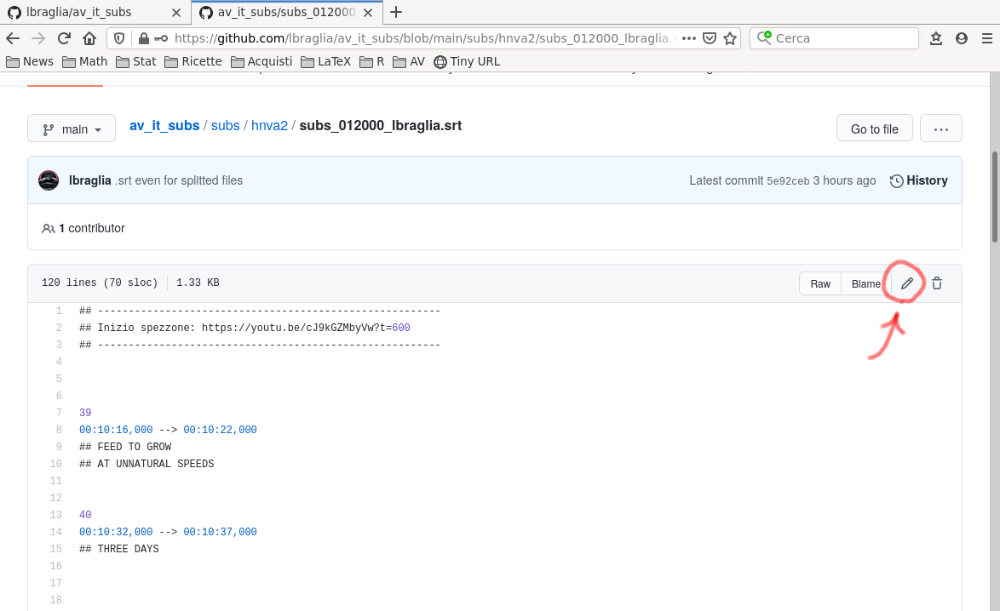

# AV subs (IT)

## NB/Aggiornamento

**Attenzione**: in questo momento stiamo lavorando per

* costituire il team di traduzione, contarci, organizzarci;
* terminare di mettere a punto infrastruttura e documentazione;
* ottenere il file da tradurre (ossia inglese validato e in sync con
  il video).

Al momento pertanto *non è possibile ancora tradurre* (portate
pazienza ;) ); tuttavia, per mettersi avanti, è possibile
impratichirsi con lo strumento che verrà impiegato con la traduzione
(una volta pronti) mediante comandi `#sandbox`, come descritto sotto.

Appena sarà possibile iniziare a tradurre ne verrà data comunicazione
nella chat "AV: Traduzioni e Sub YouTube", dopodiché si accetteranno
"comandi" `#translate`.

Stay tuned.

## Setup/Overview

Per poter contribuire alla traduzione, dopo aver letto le linee guida
del gruppo Telegram "AV: Traduttori e Revisori", occorre:

1. creare (gratuitamente) un account su [GitHub](https://www.github.com) ("Sign
   Up" e seguire la procedura sino a verificare la mail);

2. nel gruppo Telegram "AV: Traduzioni e Sub YouTube", dare il "comando":

	```
	@lucailgarb #sandbox
	```
	per richiedere la predisposizione di un file di prova (prima di
	passare alle modifiche sui subs ufficiali).
	
	Verrà risposto un nome file: tradurlo e sottomettere la revisione,
	*come illustrato nel seguito* (occorre leggere fino a fine pagina
	per saper cosa/come fare).
	
	Quando ci si sente ragionevolmente a proprio agio con la procedura
    di modifica/sottomissione (si può chiedere `#sandbox` più volte) si
    può passare allo step successivo;

3. per richiedere l'assegnazione di uno spezzone di sottotitoli dare
   il comando:
   
	```
	@lucailgarb #translate
	```

## Formato sottotitoli 

I sottotitoli sono in formato `.srt` ossia un file di testo (tipo
`.txt`) con una struttura precisa, da rispettare/non modificare.

Ad esempio, di seguito uno stralcio per i primi secondi del video che usiamo
ai cubi:

```
1
00:00:00,000 --> 00:00:01,200
PRODOTTI CASEARI

2
00:00:02,000 --> 00:00:24,000
INSEMINAZIONE FORZATA

3
00:00:33,000 --> 00:00:49,000
SEPARAZIONE DEI NEONATI

4
00:00:51,000 --> 00:01:04,000
QUESTA È UNA PRATICA STANDARD
```

Vi è dunque:
* un numero progressivo del sottotitolo;
* i secondi di inizio e fine della sua visualizzazione;
* il testo (che può essere organizzato su più righe);
* una linea bianca di separazione.

Questo è quello a cui dobbiamo, *alla fine di tutto*, arrivare.


## Come/cosa modificare
Per permettere la **revisione** delle traduzioni noi lavoreremo su un file
*lievemente diverso*, che includa sia l'originale che la traduzione.
Questo è quello che troverete:
```
3
00:00:33,000 --> 00:00:49,000
## NEWBORN SEPARATION


4
00:00:51,000 --> 00:01:04,000
## THIS IS STANDARD PRACTICE


```

Quello che dovrete fare è la cosa seguente: 
* lasciare tutto immutato;
* aggiungere la linea tradotta in italiano sotto a quella inglese;
* lasciare sempre una linea di spazio alla fine.

Come segue:
```
3
00:00:33,000 --> 00:00:49,000
## NEWBORN SEPARATION
SEPARAZIONE DEI NEONATI


4
00:00:51,000 --> 00:01:04,000
## THIS IS STANDARD PRACTICE
QUESTA È PRATICA STANDARD


```

<!-- Infine nella traduzione occorre rispettare lo stile -->
<!-- maiuscolo/minuscolo e l'eventuale splitting su più righe, ossia è -->
<!-- corretto procedere come segue: -->
<!-- ``` -->
<!-- ## THIS IS STANDARD PRACTICE -->
<!-- QUESTA È UNA PRATICA STANDARD -->


<!-- ## This is standard practice -->
<!-- Questa è una pratica standard -->


<!-- ## This is a very very -->
<!-- ## long subtitle -->
<!-- Questo è un sottotitolo -->
<!-- verameeente lungo -->

<!-- ``` -->


## Istruzioni per i traduttori

<!-- Prima di procedere ad una traduzione occorre: -->

<!-- * sentire il proprio spezzone per intero, più volte se necessario, per -->
<!--   comprendere l'argomento -->

<!-- * magari per contesto può essere utile sentire anche un po' di pezzo -->
<!--   precedente, per il legame -->
  
<!-- * guardare il file da tradurre per la trascrizione -->

<!-- * chiedere in chat per eventuali dubbi linguistici -->

<!-- * procedere alla modifica/traduzione -->


Per lavorare alle traduzioni:

0. da **computer**, effettuare il login su [GitHub](https://www.github.com);

1. aprire [questa](https://github.com/lbraglia/av_it_subs) pagina, dove sono
   conservate le traduzioni;

2. nel gruppo Telegram "AV: Traduzioni e Sub YouTube" dare il "comando":

	```
	@lucailgarb #translate
	```
	Per richiedere l'assegnazione di un file da tradurre.
	Verrà risposto (quanto prima) un messaggio con la posizione del 
	file, del tipo:
	
	```
	subs/hnva2/subs_012000_luca_braglia
	```
	che sta a significare: ti è stato assegnato
	
	* il file `subs_012000_luca_braglia` (uno
	spezzone di sottotitoli che inizia approssimativamente a
	`01:20:00` nel video) 
	* che si trova nella cartella `hnva2` (che contiene i sottotitoli
	per "Holding Non-Vegans Accountable 2.0") 
	* posta nella cartella `subs` (che racchiude tutti i
	sottotitoli di tutti i video).

3. cliccare quindi sulla cartella `subs`
   
   

4. cliccare sulla cartella del video (`hnva2` nell'esempio)

	

5. arrivati a questo punto conviene **salvare questa pagina nei
   preferiti** (per accedervi facilmente alle prossime sessioni)
   perché tutte i file di un dato video si trovano qui e si
   velocizzerà l'accesso al file assegnato.

   Cliccare dunque sul nome del file che ci è stato assegnato
   (`subs_012000_luca_braglia` nell'esempio);

   

6. cliccare sul pulsante matita (quello a destra dei bottoni `Raw` e
   `Blame`) per modificare il file; 

   

7. fare le modifiche/tradurre (non preoccuparsi del messaggio "You are
   making changes ...")
   
   

   Se si vuole avere un sommario delle modifiche effettuate spostarsi
   nel tab `Preview changes`;

6. a termine sessione, quando si vuole "salvare", scorrere in basso
   nella pagina, verso la sezione `Propose changes`: cliccare sul
   tasto verde `Propose changes`

	

7. cliccare sul pulsante verde `Create Pull Request`
   
   

8. cliccare su `Create Pull Request`;

	

9. fine!! In seguito a revisione informatica di minima le modifiche
   saranno accettate ed integrate.  Modifiche che impattino su qualsiasi
   cosa diversa dalla traduzione (es progressivo sottotitolo, secondi)
   saranno verosimilmente rifiutate.

	Ora, se si è *terminato il proprio file* la prossima sessione re-iniziare
    da 2 per chiedere un nuovo file da modificare.
	
	Alternativamente *se occorre finire il file assegnato*,
    ri-cominciare da 5 (tener conto che le modifiche in precedenza
    apportate non saranno visualizzate se non saranno state da me già
    approvate, ma tuttavia sono state sottomesse/non perse)


<!-- ## Considerazioni sul workflow -->

<!-- Come pro vedo: -->

<!-- - se vi è priorità/urgenza, si può lavorare tutti sullo stesso file -->
<!--   contemporaneamente (anche se è *meglio suddividersi il lavoro*, es -->
<!--   sulla base dei secondi del video, per evitare di duplicare lo sforzo -->
<!--   di traduzione), rendendo il tutto più veloce; -->

<!-- - mi pare tutto sommato abbastanza semplice (per problemi ditemi): in -->
<!--   particolare i traduttori possono limitarsi a fare "solamente" i -->
<!--   traduttori - senza doversi preoccupare di altri aspetti -->
<!--   (es informatici) - mentre altri che magari sono meno -->
<!--   "prima scelta" in traduzione (come il sottoscritto) si possono -->
<!--   focalizzare su questi ultimi; -->
  
<!-- - non serve software particolare, non problemi di formato file / -->
<!--   sistemi operativi differenti, no file "volanti" inviati per mail; -->

<!-- - immediato lo stato di avanzamento delle varie traduzioni, anche più -->
<!--   facile prioritarizzare. -->
