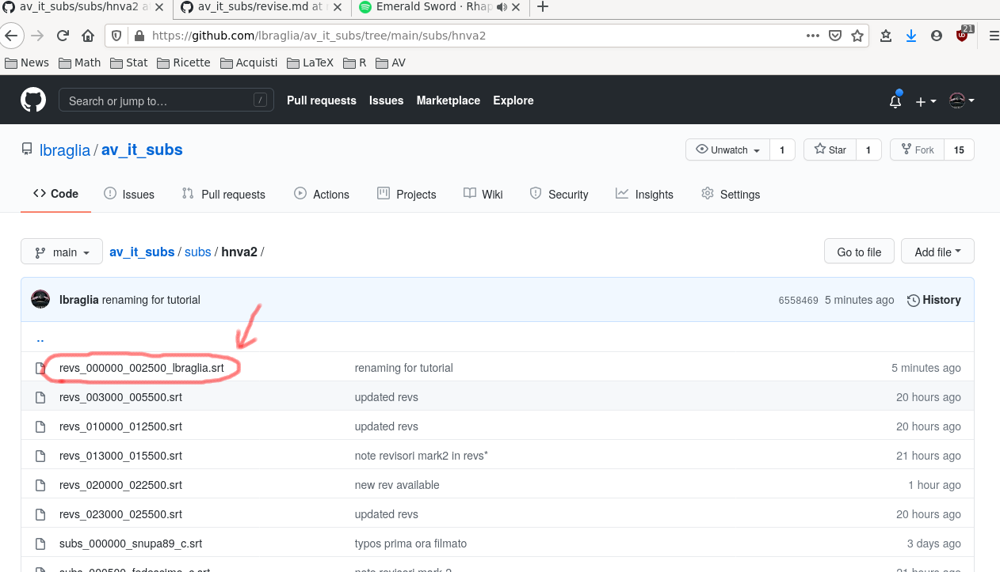
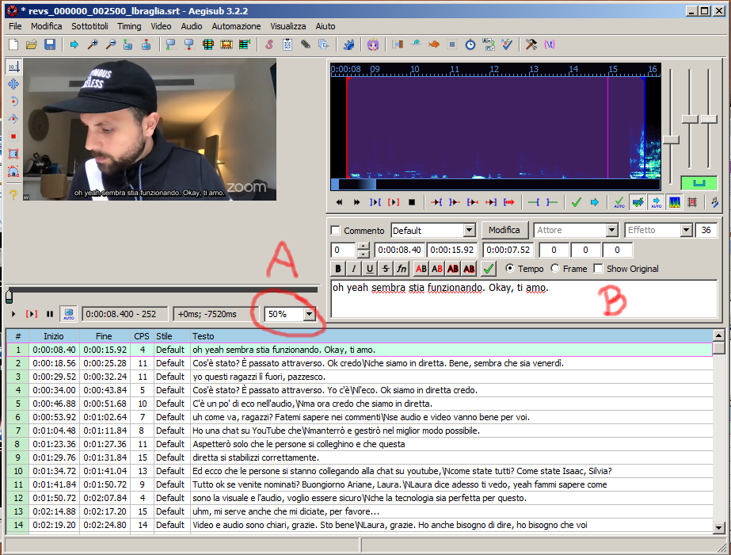
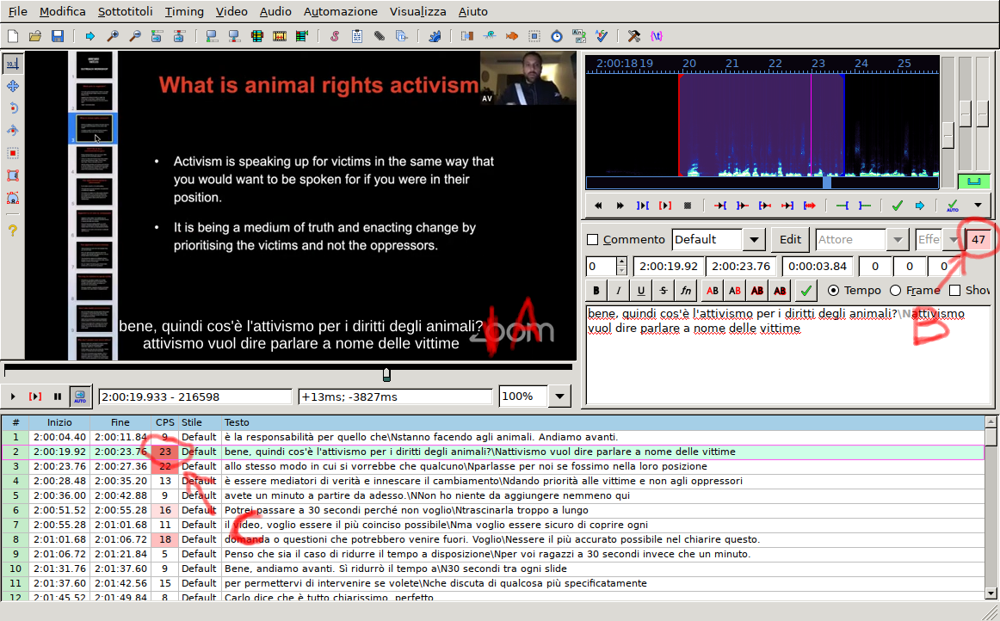

# Istruzioni per revisori


Risorse | Link 
--------|:----:
Obbligatorie | [[Guidelines linguistiche]](https://drive.google.com/file/d/1GuYx3r637srhyxY2QYfKYO9Jbka-_gKd/view?usp=sharing), [[Aegisub]](http://www.aegisub.org/)
Consigliate | [[Telegram Web]](https://web.telegram.org), [[Telegram Desktop]](https://desktop.telegram.org/)

## Introduzione
La revisione avviene in due fasi:

1. la prima è linguistica e avviene, in itinere, durante la traduzione;

2. la seconda riguarda aspetti di leggibilità e avviene al termine di
   traduzione/revisione linguistica.

## Prima fase

### Setup
Per poter effettuare revisioni per un dato video, dopo aver letto le
[guidelines linguistiche](https://drive.google.com/file/d/1GuYx3r637srhyxY2QYfKYO9Jbka-_gKd/view?usp=sharing)
occorre:

1. creare (gratuitamente) un account su
   [GitHub](https://www.github.com) ("Sign Up" e seguire la procedura
   sino a verificare la mail);
   
2. comunicarmi lo username GitHub con cui intendete collaborare, per
   [abilitazione](../data/users.csv). 

	Verrà risposto un nome file di prova: revisionarlo e sottomettere
	la revisione, *come illustrato* nella procedura esposta per
	[traduttori](translate.md).

	Una volta fatto, se ci si sente ragionevolmente a proprio agio con
    la procedura di modifica/sottomissione si può passare allo step
    successivo, alternativamente si può chiedere
	
	```
	@lucailgarb #rev1-sandbox
	```
	per la predisposizione di un altro file di prova.


### Processo step by step

Nell'attività di revisione rimangono valide chiaramente tutte le
[regole](translate.md#guidelines-leggibilità-per-traduttori) per i
traduttori. Per effettuare materialmente la revisione linguistica:

* appena un traduttore comunica "tradotto" al proprio spezzone ne
  viene data comunicazione mediante tag ai revisori;

* uno dei revisori risponde con **in revisione** per autoassegnarsi lo
  spezzone in base alle proprie disponibilità;

* dopodiché il revisore rivede il file disponibile su GitHub (con le
      stesse modalità adottate dai traduttori). Se:

	- non sono necessarie modifiche risponde al nome del file con
      **completato**;
	  
	- sono sufficienti modifiche minori le apporta, dopodiché risponde
	  **completato**;
	  
	- sono necessarie modifiche da parte del traduttore le segnala via
	  commento (sempre modificando il file su GitHub) come segue:
	  
	  ```
	  3
	  00:00:33,000 --> 00:00:49,000
	  ## Linea 1 in inglese
	  ## Linea 2 in inglese
	  Testo tradotto
	  testo tradotto
	  ## Commento per i traduttori
	  ## commento per i traduttori

  
	  4
	  ...
	  ```
	  
	  Da notare che il commento va dopo *2 cancelletti*, come *ultima linea*
	  e assicurandosi che dopo vi sia sempre **almeno una linea vuota di
	  separazione**.
	  
	  Dopodichè comunica al traduttore (via Telegram) la necessità di
	  rivedere la traduzione; l'interazione continuerà fino a quando
	  la traduzione sarà ok, dopodiché il revisore risponderà 
	  **completato** al nome file.


Uno screenshot sintetico a seguire:


## Seconda fase

### Setup
Per poter revisionare la leggibilità di sub occorre:
1. installare [Aegisub](http://www.aegisub.org/), il programma con cui verrà
   controllato il proprio spezzone.
   
   Per quanto riguarda Windows è possibile eventualmente optare per la
   versione portabile (che non richiede installazione e quindi i
   permessi di amministratore sulla macchina).

2. per abilitazione alle richieste di revisione, correggere e inviarmi
   (Telegram o a lbraglia@gmail.com) il file di prova
   [`subs/sandbox/template_rev2.srt`](https://raw.githubusercontent.com/lbraglia/av_it_subs/main/subs/sandbox/template_rev2.srt)
   (come spiegato in seguito) che è basato sul [questo
   video](https://drive.google.com/file/d/1sCzIOzn6hRy0mvu3zgorERCDX_3IwRH0/view?usp=sharing)
   (da scaricare);

3. una volta ottenuta abilitazione, scaricare il video senza
   sottotitoli su cui stiamo lavorando: il link si trova nella [pagina
   principale](../README.md), ad esempio (per hnva2) qui:

	

4. periodicamente (quando disponibili) nel gruppo Telegram "AV:
   Traduzioni e Sub YouTube" verrà comunicata la disponibilità di file
   per la revisione di leggibilità. Si può richiedere una assegnazione
   mediante:
   
	```
 	@lucailgarb #revise
 	```


<!-- ### Il file su cui lavoriamo -->

<!-- Il file su cui dobbiamo operare attraverso Aegisub: -->

<!-- * è stato creato durante il processo di traduzione/revisione -->
<!--   linguistica ed è il collage di più file sequenziali prodotti da -->
<!--   traduttori/revisori diversi; -->

<!-- * include solamente la traduzione rivista in italiano, dato che per -->
<!--   l'inglese è disponibile l'audio originale (attraverso il caricamento -->
<!--   del video); -->
  
<!-- * presenta eventuali commenti lasciati ai revisori come ultima linea -->
<!--   di sottotitolo, preceduta da `# REVISORI: ...`. Ad esempio -->
<!--   in presenza di un commento a video verrà visualizzato: -->
  
<!--   ``` -->
<!--                     Testo tradotto -->
<!--                    Testo tradotto 2 -->
<!--   # REVISORI: qui nel dubbio si è optato per XYZ perché ... -->
<!--   ``` -->
<!--   Ovviamente, una volta risolto il punto, il commento per i revisori  -->
<!--   andrà cancellato. Incidentalmente la presenza di commenti tenderà ad  -->
<!--   essere segnalata da metriche di caratteri, per ovvi motivi; -->

<!-- * in corrispondenza dei sub di inizio spezzone è stato posto il -->
<!--   commento `# REVISORI: primo sub di spezzone`, per segnalare -->
<!--   l'esigenza di continuità tra quello che precede e quello che segue -->
<!--   (prodotto da traduttori/revisori differenti/indipendentemente). -->


### Il processo step-by-step

Per lavorare alle revisioni:

1. periodicamente (quando disponibili) nel gruppo Telegram "AV:
   Traduzioni e Sub YouTube" verrà comunicata la disponibilità di file
   per la revisione di leggibilità. Si può richiedere una assegnazione
   mediante:
   
	```
	@lucailgarb #revise
	```
	
	Verrà risposto (quanto prima) un messaggio con la posizione del
	file, del tipo:

	```
	subs/hnva2/revs_000000_002500_lbraglia.srt
	```
	che sta a significare: ti è stato assegnato

	* il file `revs_000000_002500_lbraglia.srt` (uno
	spezzone di sottotitoli che include da quelli aventi inizio a
	`00:00:00` a quelli aventi inizio a `00:25:00`)
	* che si trova nella cartella `hnva2` (che contiene i sottotitoli
	per "Holding Non-Vegans Accountable 2.0")
	* posta nella cartella `subs` (che racchiude tutti i
	sottotitoli di tutti i video).


2. aprire [questa](https://github.com/lbraglia/av_it_subs) pagina, dove sono
   conservate le traduzioni;

3. cliccare quindi sulla cartella `subs`

   

4. cliccare sulla cartella del video (`hnva2` nell'esempio)

	

5. arrivati a questo punto conviene **salvare questa pagina nei
   preferiti** (per accedervi facilmente alle prossime sessioni)
   perché tutte i file di un dato video si trovano qui e si
   velocizzerà l'accesso al file assegnato.

   Cliccare dunque sul nome del file che ci è stato assegnato
   (`revs_000000_002500_lbraglia.srt` nell'esempio);

   

6.  Cliccare su `Raw` per ottenere il file;

   

7.  Ora per fare il download del file:

	* in Firefox: cliccare col pulsante destro, selezionare "Salva pagina con nome" o qualcosa di linguisticamente analogo
	* in Chrome: cliccare col destro, selezionare "Salva con nome..." o qualcosa di linguisticamente analogo
	
	Dopodiché **cancellare** eventuali estensioni `.txt` se proposte dal proprio browser (mentre il "Salva come" è irrilevante)


   

	
   


8. arrivati a questo punto dovremmo avere sia il video che i subs da editare
   in una opportuna cartella (oppure sul Desktop):

   

9. fare doppio click sul file `.srt` per fare in modo che Aegisub lo
    inizi ad editare.
	
	Se compare un messaggio del tipo "Aegisub non può restringere il
	set di caratteri" scegliere `UTF-8`.
	
	Arriviamo ad una schermata analoga:
	
   

10. per caricare il video cliccare `Video -> Apri video`, dopodiché 
	selezionarlo:

   

11. una volta importato il file ci troviamo in una situazione del
	genere, dove si consiglia massimizzare la finestra a tutto
	schermo, porre A al 100% e si possono editare i sottotitoli
	nel riquadro B

   

12. iniziare il controllo/editing seguendo quanto consigliato [più
	sotto](revise.md#editing-con-aegisub);

13. Importante: **salvare** il lavoro e fare i **backup** del file
    `.srt` editato;

14. una volta concluso l'editing del proprio spezzone, inviarmi il
    file (come si preferisce, Telegram o lbraglia@gmail.com) per
    archiviazione e per produzione dell'`.srt` complessivo.
	
15. *repeat* da 1.


### Editing con Aegisub

Un *workflow* minimale:
1. cliccare sulla prima riga (sub);
2. schiacciare `r` per riprodurre l'audio del sub;
3. controllare la traduzione e se necessario metterla a posto editando 
   nell'apposito riquadro. 
      
   In particolar modo controllare:
   * **corretta resa in italiano** di quello che viene detto in
	 inglese, seguendo le [guidelines linguistiche](https://drive.google.com/file/d/1IACZxWdk84rs81ElQ9OWws-aroQZDtxZ/view?usp=sharing);
   * **leggibilità** del sub, facendo riferimento alle relative
	 [guidelines](revise.md#guidelines-leggibilità-per-revisori) di
	 cui sotto.

   Evitare di modificare:
   * formattazione (es non aggiungere grassetti etc, per compatibilità);
   * *timing* dei sottotitoli.

   Se necessario spezzare linee inserire/spostare `\N` (ottenibile
   anche, nel riquadro di editing B, mediante `Shift+Invio`);

4. se si sono apportate modifiche, salvare con `Ctrl+S`;
5. muoversi al prossimo sottotitolo cliccando la rispettiva linea col
   tasto sinistro del mouse;
6. *repeat* da 2;
7. una volta editati tutti i sottotitoli si può dare un check
   complessivo facendo doppio click sul primo sub e comandando
   `Ctrl+P` per riprodurre il video con i sottotitoli rivisti.


### Guidelines leggibilità

In questa fase le guidelines per la revisione sono:

Issue | Regola e/o esempio
------|---------------
\# linee per sub     | max 2  (`A` nella figura sottostante)
Lunghezza linea      | max 42 caratteri (`B` nella figura sottostante); [qui](https://translations.ted.com/How_to_break_lines) consigli su come "spezzare"
CPS                  | max 30 chars/sec (`C` nella figura sottostante)

<!-- Minimum duration | Subtitles should be at least 0.7 seconds. -->
<!-- Maximum duration | Split subtitles longer than 7 seconds. -->

<!-- Speaker identification Identify off-screen and unclear speakers in parentheses. -->
<!-- 	ex: (Michael) Wait for me! -->
<!-- 		Foreign language Identify relevant speech in foreign language. -->
<!-- 		ex: (Russian): Thank you. -->

### Statistiche di leggibilità in Aegisub

A per numero linee, B lunghezza linea (massima) e C il CPS per il sub
considerato (il secondo).


