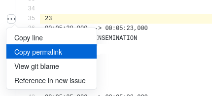

# Come affrontare la traduzione al meglio


## Risorse obbligatorie o caldamente consigliate

Obbligatorie:
[Linee guida](https://drive.google.com/file/d/1IACZxWdk84rs81ElQ9OWws-aroQZDtxZ/view?usp=sharing)

Caldamente consigliate:
[Telegram Web](https://web.telegram.org)
[Telegram Desktop](https://desktop.telegram.org/)


## Il workflow da adottare

**Non** partire a testa bassa con la modifica dei subs GitHub.


## Ottenere aiuto
In caso di dubbi/difficoltà:

* per **aspetti linguistici** non esitare a chiedere un parere/aiuto al gruppo
  "AV: Traduttori e Revisori";
* per **aspetti informatici** contattami direttamente. 

Nel prosieguo ci concentriamo sulla richiesta aiuto per *aspetti
linguistici*. 

La cosa migliore che tu possa fare (per aumentare la
probabilità/velocità di risposta) è un post dettagliato in "AV:
Traduttori e Revisori"che contenga:

* info sul punto di interesse (in YT ed eventualmente in GitHub);
* info sul dubbio/difficoltà.

Ad esempio (con link fittizi):

```
Care/i, ho difficoltà su come tradurre 'attorno' al sottotitolo 234 che
trovate qui

https://youtu.be/cJ9kGZMbyVw?t=3455

e per il testo "fermo" qui: 

https://youtu.be/cJ9kGZMbyVw?t=3455

https://github.com/lbraglia/av_it_subs/blob/662b792247f56e3203d635d977658c7a6d7ef511/source/test_en.srt#L54

In particolar modo sono indeciso su ...
``` 

Per costruire un post del genere (che facilita/velocizza
incredibilmente il darti una mano) serve ottenere i link ad un
determinato punto in YouTube e GitHub. 
 
Inoltre può essere molto comodo scrivere tale post mediante
un'applicazione come Telegram Web (e se ti trovi bene vi consiglio di
passare a Telegram Desktop).


### Ottenere il link al video in un dato punto

Innanzitutto per comodità all'inizio del file da tradurre vi è un url
che porta


### Ottenere il link ai subs in un dato punto

Aprire il file assegnato su GitHub e posizionarsi nei pressi del
sottotitolo in questione (es


Cliccare sulla riga di interesse





