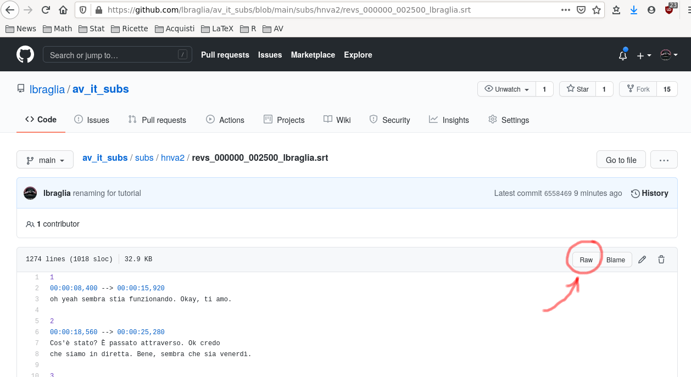
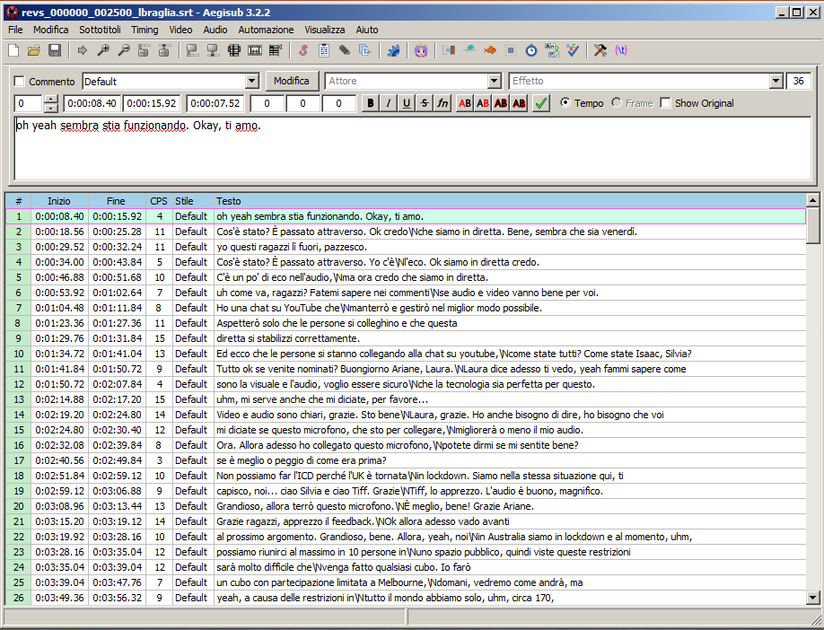

# Istruzioni per revisori


Risorse | Link 
--------|:----:
Obbligatorie | [[Linee guida]](https://drive.google.com/file/d/1IACZxWdk84rs81ElQ9OWws-aroQZDtxZ/view?usp=sharing), [[Aegisub]](http://www.aegisub.org/)
Consigliate | [[Telegram Web]](https://web.telegram.org), [[Telegram Desktop]](https://desktop.telegram.org/)


## Il file su cui lavoriamo per la revisione

Il file su cui dobbiamo operare è stato creato durante il processo di
traduzione.

## Setup

Per poter effettuare revisioni per un dato video, dopo aver letto le [linee
guida](https://drive.google.com/file/d/1IACZxWdk84rs81ElQ9OWws-aroQZDtxZ/view?usp=sharing) occorre:

1. installare [Aegisub](http://www.aegisub.org/), il programma con cui
   verrà controllato il proprio spezzone. Per quanto riguarda Windows
   è possibile eventualmente optare per la versione portabile (che non
   richiede installazione e quindi i permessi di amministratore sulla
   macchina);

2. scaricare (la prima volta) il video senza sottotitoli: il link si
   trova nella [pagina principale](README.md), ad esempio (per hnva2)
   qui:

	

3. periodicamente (quando disponibili) nel gruppo Telegram "AV:
   Traduzioni e Sub YouTube" verrà comunicata la disponibilità di file
   per la revisione. Si può richiedere una assegnazione mediante:
   
	```
	@lucailgarb #revise
	```
	
	Verrà risposto (quanto prima) un messaggio con la posizione del
	file, del tipo:

	```
	subs/hnva2/revs_000000_002500_lbraglia.srt
	```
	che sta a significare: ti è stato assegnato

	* il file `revs_000000_002500_lbraglia.srt` (uno
	spezzone di sottotitoli che include da quelli aventi inizio a
	`00:00:00` a quelli aventi inizio a `00:25:00`)
	* che si trova nella cartella `hnva2` (che contiene i sottotitoli
	per "Holding Non-Vegans Accountable 2.0")
	* posta nella cartella `subs` (che racchiude tutti i
	sottotitoli di tutti i video).

4. cliccare quindi sulla cartella `subs`

   

5. cliccare sulla cartella del video (`hnva2` nell'esempio)

	

6. arrivati a questo punto conviene **salvare questa pagina nei
   preferiti** (per accedervi facilmente alle prossime sessioni)
   perché tutte i file di un dato video si trovano qui e si
   velocizzerà l'accesso al file assegnato.

   Cliccare dunque sul nome del file che ci è stato assegnato
   (`revs_000000_002500_lbraglia.srt` nell'esempio);

   

7.  Cliccare su `Raw` per ottenere il file;

   

8.  Ora per fare il download del file:

	* in Firefox: cliccare col pulsante destro, selezionare "Salva pagina con nome" o qualcosa di linguisticamente analogo
	* in Chrome: cliccare col destro, selezionare "Salva con nome..." o qualcosa di linguisticamente analogo
	
	Dopodiché **cancellare** eventuali estensioni `.txt` se proposte dal proprio browser (mentre il "Salva come" è irrilevante)


   

	
   


9. arrivati a questo punto dovremmo avere sia il video che i subs da editare
   in una opportuna cartella (oppure sul Desktop):

   

10. fare doppio click sul file `.srt` per fare in modo che Aegisub lo
    inizi ad editare:
	
   

11. per caricare il video cliccare `Video -> Apri video`

   

12. una volta importato il file ci troviamo in una situazione del genere:

   

13. per posizionare il video al primo sub (es soprattutto per i file
    che iniziano più avanti di `00:00:00`), fare due clic sulla linea
    del primo sub nella lista, dopodiché schiacciare il tasto play e
    iniziare il controllo/editing;

14. Importante: **salvare** il lavoro e fare i **backup** del file
    `.srt` editato;

15. una volta concluso l'editing inviarmi la versione finale per
    archiviazione e per produzione dell'`.srt` complessivo.


## Il workflow da adottare


## Ottenere aiuto
In caso di dubbi/difficoltà:

* per **aspetti linguistici** non esitare a chiedere un parere/aiuto al gruppo
  "AV: Traduttori e Revisori" seguendo [queste istruzioni](help.md);
* per **aspetti informatici** contattami direttamente.

